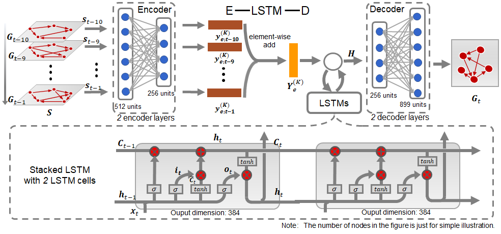
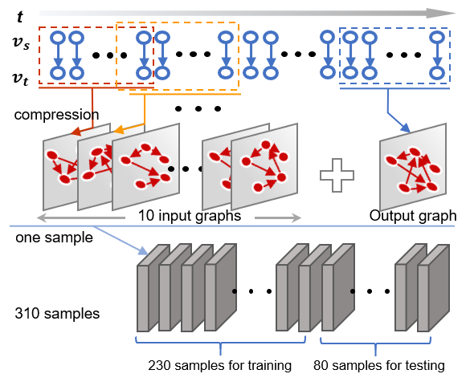

# e-lstm-d

This is a TensorFlow implementation of the paper: [E-LSTM-D: A Deep Learning Framework for Dynamic Network Link Prediction](https://arxiv.org/abs/1902.08329). The baselines used in the paper will be released as a toolbox soon.


# Requirements 
- tensorflow (1.3.0)
- keras (2.2.4)
- scikit-learn (0.19.0)
- numpy (1.14.2)

# run the demo
#### The framework of E-LSTM-D

We provide the framework of E-LSTM-D and the detailed structure of it when applied on LKML. 



#### Data processing



1. prepare the data
```
mkdir data
tar -xzvf contact.tar.gz ./data
```

2. train model
```
python train_model.py --dataset contact --encoder [128] --lstm [256,256] --decoder [274] --num_epochs 1600 --batch_size 32 --BETA 10 --learning_rate 0.001
```

# Cite
Please cite our paper if you use this code in your own work:
```
@article{chen2019lstm,
  title={E-LSTM-D: A Deep Learning Framework for Dynamic Network Link Prediction},
  author={Chen, Jinyin and Zhang, Jian and Xu, Xuanheng and Fu, Chengbo and Zhang, Dan and Zhang, Qingpeng and Xuan, Qi},
  journal={arXiv preprint arXiv:1902.08329},
  year={2019}
}
```
